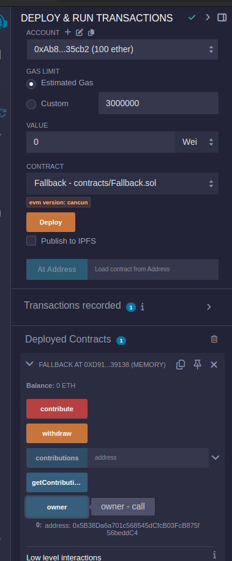
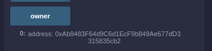
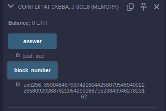
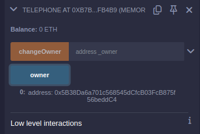
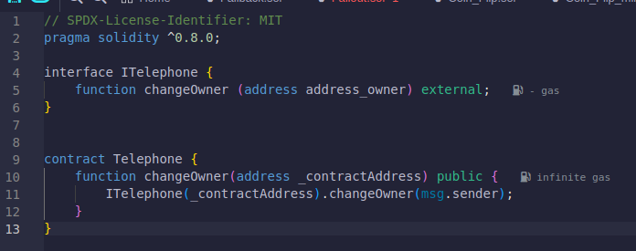
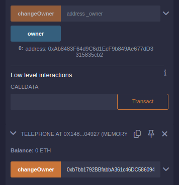
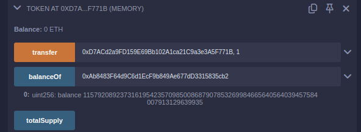

## Системы электронной валюты

- задачи с сайта: https://ethernaut.openzeppelin.com/
- IDE: https://remix.ethereum.org/
- Использовался Remix VM, чтобы не иметь проблем с тестовым эфиром
- Для всех контрактов одинаковый метод использования (compile & deploy)

[1 Fallback (уязвимость в receive)](#1)  
[2 Fallout (конструктор назван иначе, чем контракт)](#2)  
[3 Coin Flip (предсказуемая случайность)](#3)  
[4 Telephone (возможность вызвать контракт через другой контракт)](#4)  
[5 Token (переполнение буфера - underflow)](#5)  
[10 Re-entrancy (уязвимость в receive)](#10)  

<h2 id="1">1 Fallback (уязвимость в receive)</h2>
Задача:
- Овладеть контрактом и списать баланс  

Уязвимость: 
- owner может быть изменен в методе receive()

Решение: 

- определим начального владельца (адрес - *ddC4), вызвав метод owner, наш аккаунт имеет адрес: *cb2

- вызовем метод contribute для пополнения нашего баланса в контракте, приложив малую сумму
- вызовем метод receive, используя Low level interactions (кнопка "transact"), приложим малую сумму
- удостоверимся, что owner изменился, вызвав owner, далее вызовем метод вывода withdraw

<h2 id="2">2 Fallout (конструктор назван иначе, чем контракт)</h2>
Задача:
- Овладеть контрактом 

Уязвимость: 
- конструктор назван иначе, чем контракт, что позволяет его вызвать

Решение: 

- вызовем метод Fal1out и овладеем контрактом

<h2 id="3">3 Coin Flip (предсказуемая случайность)</h2>
Задача:
- Необходимо отгадать, какая монета выпадет 10 раз

Уязвимость: 
- случайность, которая используется для определения выпавшей стороны монеты, предсказуема, так ее можно получить иным способом, не вызывая контракт и узнать ответ заранее

Решение: 

- создадим контракт-зеркало Coin_Flip_mirror, который будет выдавать нам правильный ответ (выполняя те же вычисления)

- также необходимо выжидать появление нового блока по условию начального контракта

<h2 id="4">4 Telephone (возможность вызвать контракт через другой контракт)</h2>
Задача:
- Завладеть контрактом

Уязвимость: 
- tx.origin показывает, кто создал транзакцию (первый вызов), в то время, как msg.sender показывает, кто непосредственно сам контракт

Решение: 

- напишем файл, который содержит интерфейс исходного контракта

- получим адрес первоначального контракта
- в тот же файл напишем контракт, который, используя адрес и интерфейс, вызовет метод changeOwner исходного, что и сменит владельца

<h2 id="5">5 Token (переполнение буфера - underflow)</h2>
Задача:
- Получить максимальное количество токенов контракта

Уязвимость: 
- использование небезопасных математических вычислений, что может привести к owerflow и underflow 

Решение: 

- от своего аккаунта вызовем transfer и выберем сумму больше, чем есть на контракте под нашим адресом (адрес контракта на который перевести можно выбрать любой, лучше один из своих, чтобы не потерять средства)
- из-за небезопасных функций получим переполнение.

<h2 id="10">10 Re-entrancy ()</h2>
Задача:
- украсть все средства из контракта.

Уязвимость: 
- 

Решение: 
